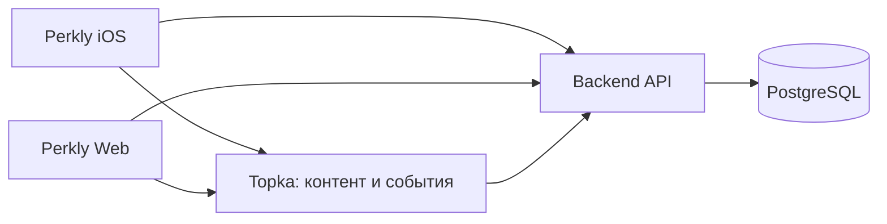

# Perkly

Perkly — единый продукт из нативного iOS-приложения, веб-приложения и общего backend API. Topka является встроенной функцией Perkly для контента и событий, а не отдельным продуктом.

## Структура

```text
apps/
├── mobile/PerklyApp/        # Swift/iOS-приложение и Widget
└── web/perkly/
    ├── frontend/            # Next.js, порт 3000
    └── backend/             # NestJS + Prisma, порт 3001

shared/                      # Общие ресурсы
docs/product/                # Продуктовая и релизная документация
Obsidian/                    # Планирование и карта документов
start_all.sh                 # Локальный запуск web + backend
deploy.sh                    # Развёртывание на сервере
```

## Карты разделов

- [`apps`](apps/README.md) — все исполняемые части продукта.
- [`iOS`](apps/mobile/PerklyApp/README.md) — SwiftUI-приложение и Widget.
- [`Web`](apps/web/perkly/README.md) — frontend, backend и инфраструктура.
- [`Frontend source`](apps/web/perkly/frontend/src/README.md) — страницы, компоненты и клиентское состояние.
- [`Backend source`](apps/web/perkly/backend/src/README.md) — карта NestJS-модулей.
- [`Topka`](docs/TOPKA.md) — встроенная функция контента и событий.
- [`Документация`](docs/README.md) — продуктовые и релизные материалы.
- [`Общие ресурсы`](shared/README.md) — брендовые assets и mock data.

## Архитектура



## Локальный запуск

После первого скачивания установите зависимости:

```bash
cd apps/web/perkly/backend && npm install
cd ../frontend && npm install
```

Затем из корня проекта:

```bash
./start_all.sh dev
```

## Документация

Продуктовые и релизные документы находятся в:

```text
docs/product
```
